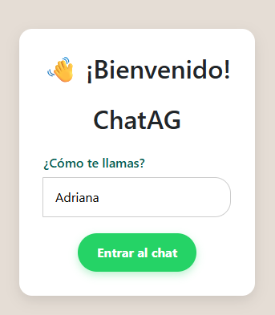
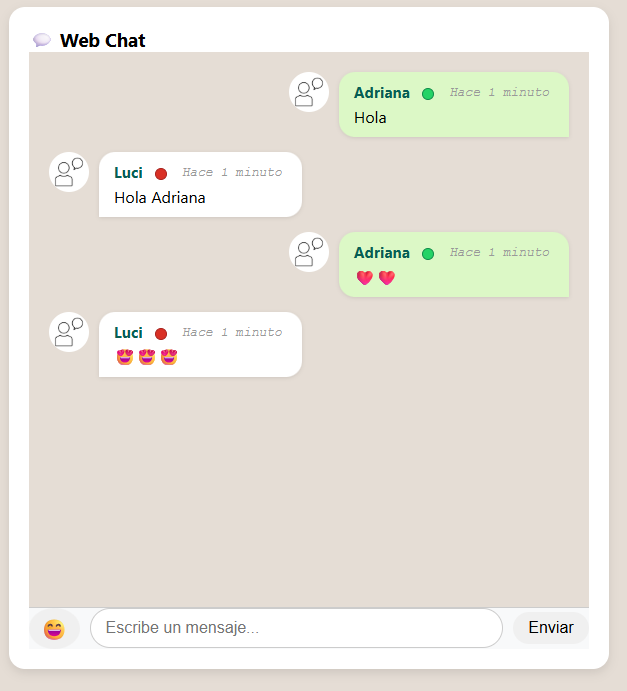
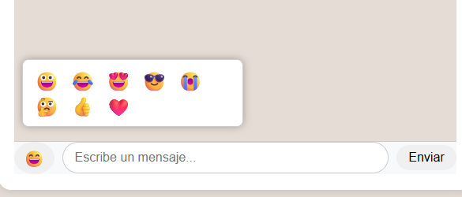
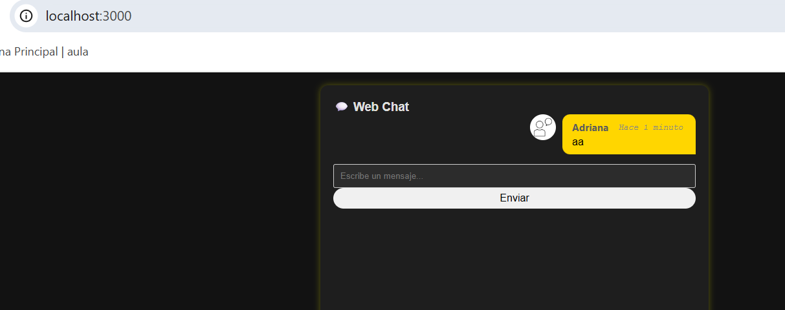

# 💬 WebChat - Adriana González

Este proyecto es una **aplicación de chat en tiempo real** desarrollada como parte de la **Tarea 2 Individual** de la materia **Aplicaciones Distribuidas**. Utiliza **Node.js**, **Socket.IO** y **Bootstrap 5**, junto con **CSS personalizado** para lograr una experiencia moderna, fluida y visualmente inspirada en WhatsApp Web.

---

## 🧠 Objetivo

Desarrollar una aplicación web que permita a múltiples usuarios conectarse, registrarse con su nombre y comunicarse en tiempo real, implementando una interfaz clara, amigable y responsiva.

---

## ⚙️ Tecnologías utilizadas

- **Node.js**  
- **Express**  
- **Socket.IO**  
- **Bootstrap 5**  
- **HTML5 + CSS3 personalizado**  
- **JavaScript (cliente y servidor)**

---

## 🚀 Funcionalidades

- ✅ Registro sencillo por nombre de usuario  
- ✅ Envío y recepción de mensajes en tiempo real  
- ✅ Diferenciación visual entre mensajes propios y ajenos  
- ✅ Indicadores de estado en línea/desconectado  
- ✅ Barra de escritura fija en la parte inferior  
- ✅ Scroll automático al nuevo mensaje  
- ✅ Selector de emojis desplegable y funcional  
- ✅ Diseño responsive y adaptado a dispositivos móviles  
- ✅ Interfaz moderna inspirada en WhatsApp Web

---

## ✨ Mejoras implementadas

- 📥 **Barra de entrada fija inferior**: El input y los botones de envío permanecen siempre visibles en la parte baja del chat, facilitando la conversación continua.
- 🎯 **Scroll automático**: Los mensajes nuevos siempre se muestran automáticamente, manteniendo la conversación actual a la vista.
- 😄 **Selector de emojis funcional**: Al hacer clic en el botón de emojis, se despliega una selección visual y amigable que se puede insertar al mensaje con un solo clic.
- 🔵 **Indicadores de conexión**: Se muestran puntos de estado (🟢 en línea, 🔴 desconectado) junto al nombre de cada usuario en sus mensajes.
- 🪄 **Estilos modernos y consistentes**: Toda la interfaz utiliza colores suaves y familiares al usuario (verde WhatsApp, fondo claro, burbujas de mensaje diferenciadas).

---

## 🖼️ Capturas de pantalla

### Registro


### Chat funcionando


### Selector de Emoji en uso


### Mensaje propio enviado


---


## 📁 Estructura del proyecto

webChat/
│
├── src/
│ ├── public/
│ │ ├── css/
│ │ ├── js/
│ │ └── img/
│ ├── routes/
│ ├── views/
│ └── index.js
├── README.md
└── package.json


---

## 🔄 Cómo ejecutar el proyecto

1. Clona el repositorio:  
   ```bash
   git clone https://github.com/Apgonzlez1/webChat.git

## Instala las dependencias:


npm install

## Ejecuta el servidor:


node src/index.js

## Abre en el navegador:


http://localhost:3000/register
## 
🙋‍♀️ Autor
Adriana González
Correo: apgonzalez1@espe.edu.ec
GitHub: @Apgonzlez1

## 

📚 Asignatura
Aplicaciones Distribuidas
