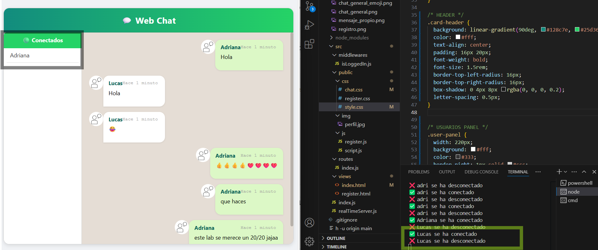
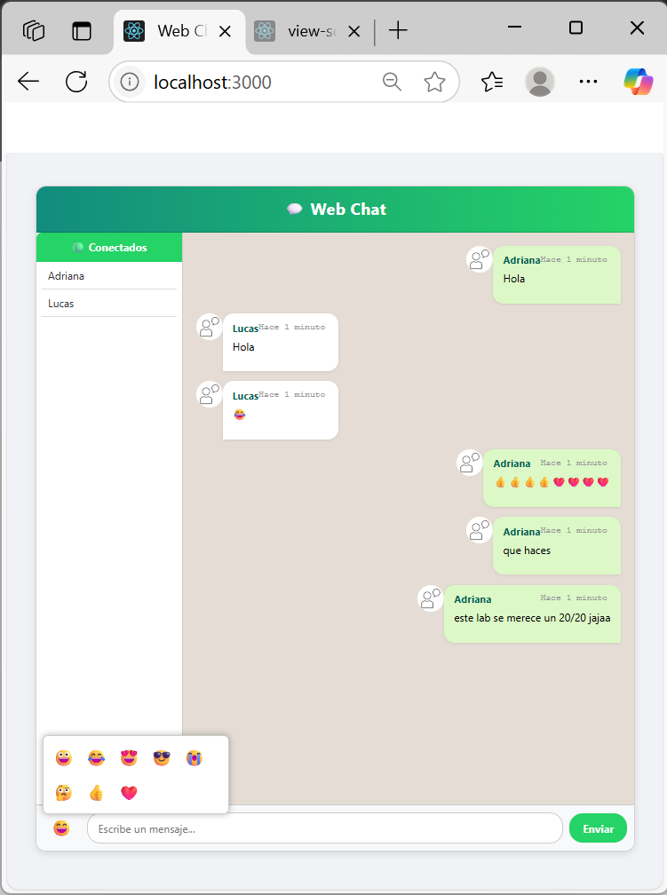

# 💬 WebChat - Adriana González

Este proyecto es una **aplicación de chat en tiempo real** desarrollada como parte de la **Tarea 2 Individual** de la materia **Aplicaciones Distribuidas**. Utiliza **Node.js**, **Socket.IO** y **Bootstrap 5**, junto con **CSS personalizado** para lograr una experiencia moderna, fluida y visualmente inspirada en WhatsApp Web.

---

## 🧠 Objetivo

Desarrollar una aplicación web que permita a múltiples usuarios conectarse, registrarse con su nombre y comunicarse en tiempo real, implementando una interfaz clara, amigable y responsiva.

---

## ⚙️ Tecnologías utilizadas

- **Node.js**  
- **Express**  
- **Socket.IO**  
- **Bootstrap 5**  
- **HTML5 + CSS3 personalizado**  
- **JavaScript (cliente y servidor)**

---

## 🚀 Funcionalidades

- ✅ Registro sencillo por nombre de usuario  
- ✅ Envío y recepción de mensajes en tiempo real  
- ✅ Diferenciación visual entre mensajes propios y ajenos  
- ✅ Indicadores de estado en línea/desconectado  
- ✅ Barra de escritura fija en la parte inferior  
- ✅ Scroll automático al nuevo mensaje  
- ✅ Selector de emojis desplegable y funcional  
- ✅ Diseño responsive y adaptado a dispositivos móviles  
- ✅ Interfaz moderna inspirada en WhatsApp Web

---

## ✨ Mejoras implementadas

- 📥 **Barra de entrada fija inferior**: El campo de texto y los botones se mantienen siempre visibles en la parte inferior del contenedor del chat.
- 😄 **Selector de emojis**: Se integró un panel de emojis visuales que se despliega sobre el input, permitiendo insertar emojis fácilmente.
- 🟢 **Barra lateral de usuarios conectados**: Nueva barra lateral tipo WhatsApp Web que lista a los usuarios activos en tiempo real, con estilos visuales mejorados.
- 🎯 **Scroll automático al último mensaje**: Se garantiza que siempre se visualice el mensaje más reciente.
- 💬 **Burbujas diferenciadas**: Se estilizó el contenedor de mensajes propios (verde claro) y ajenos (blanco) con bordes redondeados al estilo de WhatsApp.
- 🪄 **Estilo renovado y profesional**: Se aplicaron degradados, sombras y mejoras en botones, tarjetas y fuentes para una experiencia moderna y clara.
- 📱 **Diseño responsive**: Adaptado completamente a pantallas móviles con ocultamiento inteligente de la barra lateral.

---

## 🖼️ Capturas de pantalla

### 📌 Barra de escritura y emojis


### 🧍 Usuarios conectados


### 📱 Diseño responsive en móvil


### 📝 Registro de usuario


### 💬 Chat en acción


### 😂 Emoji en el mensaje


### ✅ Envío de mensaje propio


---

## 📁 Estructura del proyecto


## 📁 Estructura del proyecto


## 📁 Estructura del proyecto

webChat/
│
├── src/
│ ├── public/
│ │ ├── css/
│ │ ├── js/
│ │ └── img/
│ ├── routes/
│ ├── views/
│ └── index.js
├── README.md
└── package.json


---

## 🔄 Cómo ejecutar el proyecto

1. Clona el repositorio:  
   ```bash
   git clone https://github.com/Apgonzlez1/webChat.git

## Instala las dependencias:


npm install

## Ejecuta el servidor:


node src/index.js

## Abre en el navegador:


http://localhost:3000/register
## 
🙋‍♀️ Autor
Adriana González
Correo: apgonzalez1@espe.edu.ec
GitHub: @Apgonzlez1

## 

📚 Asignatura
Aplicaciones Distribuidas
